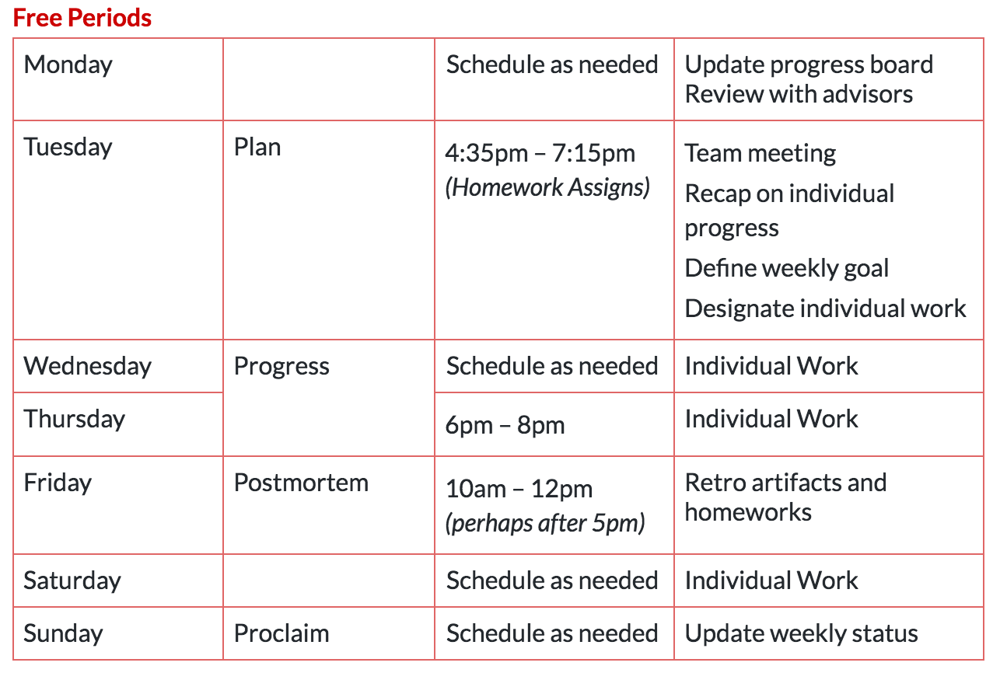

# samsung-smart-home-repository

* Link to team GitHub [https://github.com/ct-product-challenge-2017/samsung-smart-home](https://github.com/ct-product-challenge-2017/samsung-smart-home)
* Link to team Goals [https://github.com/hathaitornr/samsung-smart-home-code/projects/2](https://github.com/hathaitornr/samsung-smart-home-code/projects/2)
* 9/24 weekly progress board [https://github.com/hathaitornr/samsung-smart-home-code/projects/1](https://github.com/hathaitornr/samsung-smart-home-code/projects/1)

## Development Process 

## Description
During workshop time on Tuesdays,  the team will get together, recap on individual progress on the tasks discussed the week prior, and plan what we will do in the upcoming week. From Tuesdays to Thursdays, we will work individually and keep the team updated through emails, video chats and Slack. 

The team shall do mini-Sprints on Thursdays and Fridays (in person) to make considerable progress on our product solution. The team will also arrange conference calls with company advisor to get feedback. During the weekends, the team can work individually, conduct research, and validate prototypes with potential consumer. On Sundays, the team will reflect on what we have done this work, work on group homework assignments, and send weekly status report to company advisor.

###### Traction Control (responding to slippery conditions and roadblocks):
* Consult Deborah Estrin or Greg Pass for advice
* If necessary, contact Bill Lee for clarification
